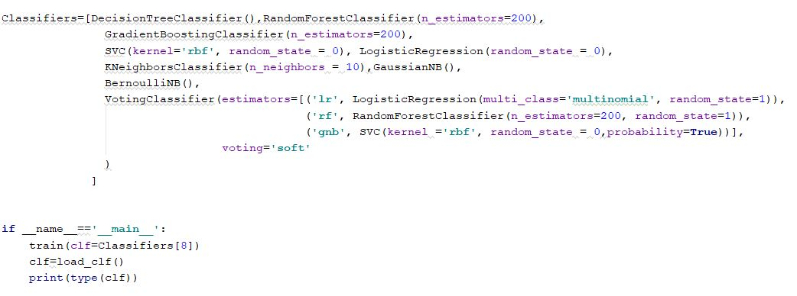

# Human Activity Recognition Dashboard


A dashboard that recognize the human activity based on readings from sensor data.

Dashboard Link on Heroku: https://human-activity-recognition-ml.herokuapp.com

## 1.Dataset Link:

https://www.kaggle.com/uciml/human-activity-recognition-with-smartphones#train.csv


## 2.Libraries used:
sklearn,pandas,pandas,dash

##3.Classifier Used:

VotingClassifier, which have the best model accuracy = 95.8%

but you can change the classifier as bellow:

- open model_code_and_Dashboard_code

```bash
$cd model_code_and_Dashboard_code
```

- open train.py 

- change train(clf=Classifiers[0]) with any classifier you want in classifiers list



- run train.py

```bash
$python train.py
```

- or you can use a classifier which isn't in classifiers' list:

   - import the classifier's library
   - change train(clf="any classifier you want")
   - run train.py
   
    ```bash
    $python train.py
    ```


## 4.installation and runining the code:

1.Create and activate a virtual environment

```bash
$python -m venv venv
$source venv/bin/activate
```

2.Install all the requirements

```bash
$pip install -r requirements.txt
```

3.Run the app

```bash
$python app.py
```

4.If you want to retrain the model
```bash
$cd model_code_and_Dashboard_code
$train app.py
```


##5.How to use my Dashboard:


1.Enter your data :

- the length of data must be = 562 like the dataset

- Example of data you should Enter => a row from the Dataset

2.Click SUBMIT


##6. A Gif that shows How to Recognize your activity by using my Dashboard :


##I use CSS files from here(''') 